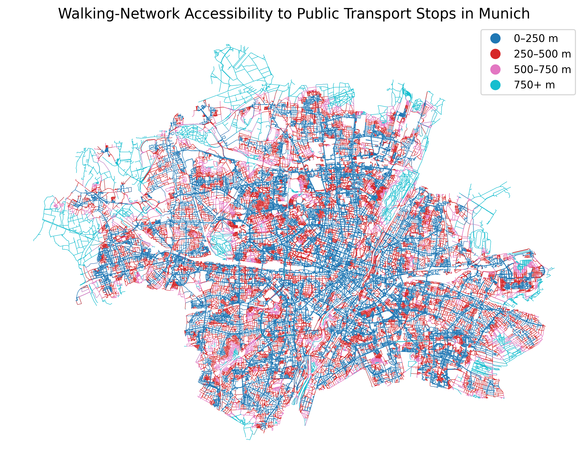
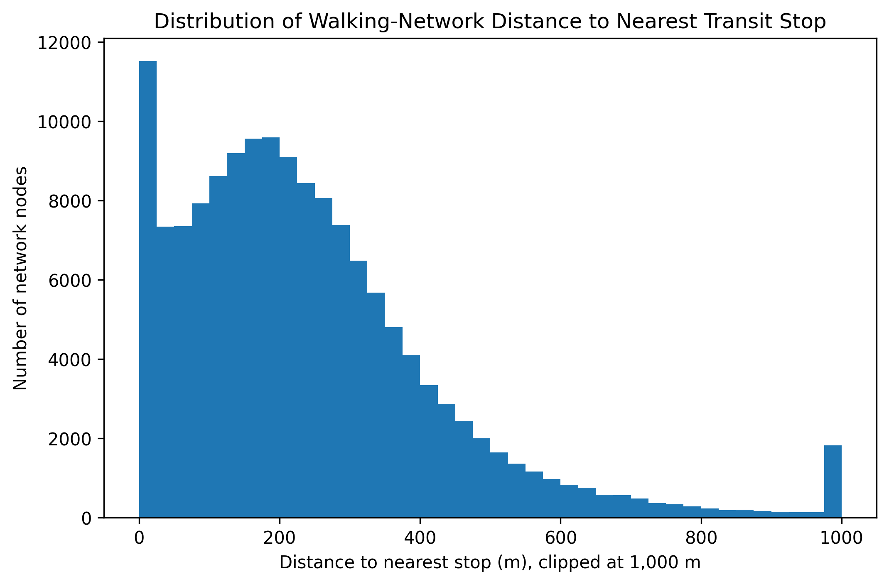

# Munich walking-network accessibility (Munich, OpenStreetMap)

This project estimates **walking-network distance** to the nearest public transport stop feature in Munich using OpenStreetMap data. It downloads Munich’s pedestrian network, extracts public-transport-related stop features from OSM tags, links stops to the network, and computes shortest-path distances along the walking graph.

The main deliverable is the notebook: `notebooks/01_munich_osmnx_accessibility.ipynb`.

## Research question

How far are locations in Munich’s walking network from the nearest public transport stop feature extracted from OpenStreetMap?

## Scope (what this is / is not)

This is a **proximity-based accessibility** example:

- **Included:** walking-network distance to the nearest extracted stop feature.
- **Not included:** transit travel time, schedules, frequency, waiting time, transfers, or route availability.

## Tools

- Python
- OSMnx
- NetworkX
- GeoPandas
- pandas
- matplotlib

## Data

Data is sourced from **OpenStreetMap** via OSMnx. Raw OSM extracts are not committed because they can be regenerated by running the notebook.

The stop feature extraction uses tags such as:

- `highway=bus_stop`
- `railway=station|halt|tram_stop`
- `public_transport=platform|stop_position|station`

## Method

1. Download the Munich walking network (`network_type="walk"`).
2. Project the network to a local metric CRS (EPSG:32632) for distance calculations.
3. Download public-transport-related OSM features and convert all geometries to point locations.
4. Snap each stop point to its nearest walking-network node.
5. Compute multi-source shortest-path distance from every node to the nearest stop-linked node (edge weight: `length`).

## Key results (example run)

Note: results can vary slightly over time as OpenStreetMap data and tagging evolve.

Accessibility band summary:

| Distance to nearest stop | Network nodes | Share |
|---|---:|---:|
| 0–250 m | 88,656 | 59.8% |
| 250–500 m | 47,184 | 31.8% |
| 500–750 m | 8,717 | 5.9% |
| 750+ m | 3,673 | 2.5% |

## Visual outputs

### Walking-network accessibility bands (edge-level)



### Distance distribution histogram



## Repository structure

```text
osm-network-accessibility-munich/
├── README.md
├── requirements.txt
├── data/
│   └── README.md
├── notebooks/
│   └── 01_munich_osmnx_accessibility.ipynb
├── outputs/
│   ├── munich_walking_network.png
│   ├── munich_transit_stops_on_network.png
│   ├── munich_edge_accessibility_bands.png
│   └── distance_distribution_histogram.png
└── src/
```

## How to run

1. Create/activate a Python environment.
2. Install dependencies:

```bash
pip install -r requirements.txt
```

3. Open and run the notebook:

`notebooks/01_munich_osmnx_accessibility.ipynb`

The notebook downloads OpenStreetMap data through OSMnx and regenerates the figures in `outputs/`.

## Limitations

- Stop features are derived from OSM tags and may include inconsistencies, omissions, or duplicates.
- The metric is **walking-network distance** to the nearest extracted stop feature (not door-to-door public transport travel time).
- No service quality indicators are included (frequency, reliability, waiting time).
- No demographic or socioeconomic indicators are included.
- The edge-level map assigns each edge the band of its start node (an approximation for readability).

## Possible next steps

- Integrate GTFS to compute schedule-based travel times.
- Compute travel-time-based accessibility (e.g., door-to-door travel time) instead of nearest-stop proximity.
- Add demographic indicators to analyze equity.
- Compare accessibility across administrative districts.
- Add network robustness metrics (connectivity, components, centrality).